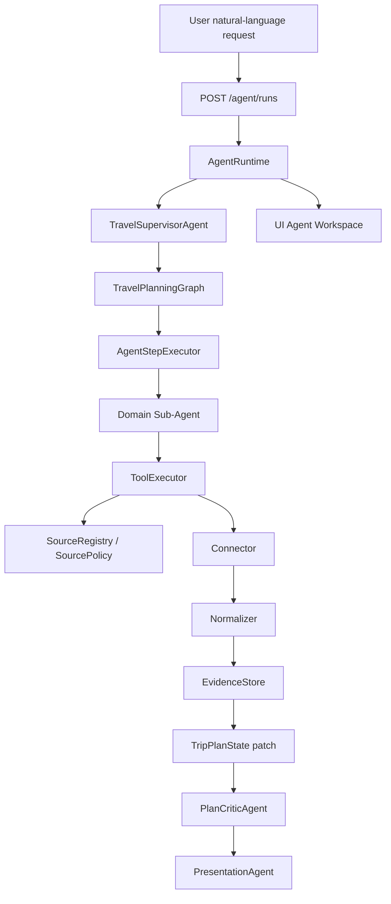

# Architecture

## Runtime flow

`AgentRuntime` creates `AgentRun`, initializes `TripPlanState`, emits events, executes the planning graph, saves checkpoints, stores evidence, and returns the latest state.

## Domain sub-agent flow

Domain agents decide required state fields, request sources through tools, consume normalized evidence, and patch `TripPlanState`.

## Evidence pipeline

Connector output is not final plan data. It becomes `EvidencePacket` with `SourceRef`, freshness policy, confidence, and mock/live metadata before agents use it.

## Approval guardrail

Booking-like actions require `ApprovalRequest`. The MVP only returns simulated booking records and never calls payment, ticketing, or booking APIs.
